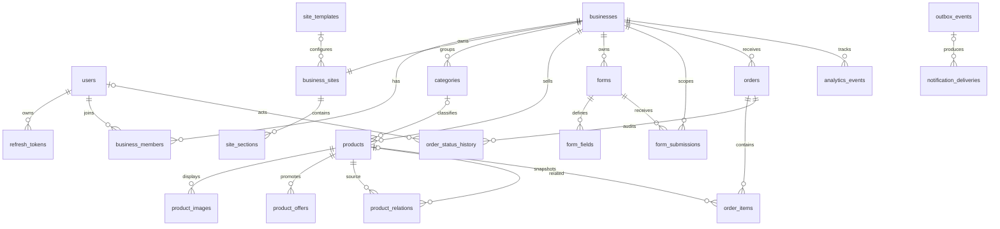

# Documentación técnica completa de El Bisne Backend

Última revisión: 23 de julio de 2026.

Esta documentación describe el comportamiento implementado actualmente. La
fuente definitiva del contrato HTTP sigue siendo `/docs` y `/openapi.json`.

## 1. Visión general

El backend es un monolito modular construido con FastAPI, PostgreSQL,
SQLAlchemy asíncrono y Alembic. Usa CQRS lógico:

```text
HTTP Route → Command/Query Bus → Handler → Service → Repository → PostgreSQL
```

- Las rutas validan y traducen HTTP; no consultan SQLAlchemy directamente.
- Los commands modifican estado dentro de un Unit of Work.
- Las queries son lecturas sin commit.
- Los handlers aplican autorización y reglas de negocio.
- Cada negocio funciona como tenant mediante `business_id`.
- Los identificadores son UUID.
- Las fechas se almacenan con zona horaria.
- El dinero usa `NUMERIC(14, 2)` y código ISO de moneda.

### URLs

| Recurso | URL |
|---|---|
| API | `http://localhost:8000` |
| Swagger UI | `http://localhost:8000/docs` |
| ReDoc | `http://localhost:8000/redoc` |
| OpenAPI JSON | `http://localhost:8000/openapi.json` |
| Prefijo de negocio | `/api/v1` |

## 2. Convenciones HTTP

### Autenticación

Los endpoints administrativos requieren:

```http
Authorization: Bearer <access_token>
```

El access token JWT identifica al usuario mediante `sub`. El refresh token es
opaco, se guarda como hash SHA-256, rota en cada uso y no puede reutilizarse.

### Errores de aplicación

Los errores controlados usan:

```json
{
  "error": {
    "code": "not_found",
    "message": "Business not found"
  }
}
```

| Estado | Significado |
|---:|---|
| `400` | Regla de aplicación inválida. |
| `401` | Token inválido/expirado o usuario no disponible. |
| `403` | Usuario autenticado sin permiso para ese negocio. |
| `404` | Recurso inexistente, archivado o no publicado. |
| `409` | Conflicto de unicidad o relación que impide borrar. |
| `422` | Payload, parámetro o transición inválidos. |

Los errores de validación automática de FastAPI/Pydantic conservan el formato
estándar `detail` de FastAPI.

### Roles y permisos

| Rol | Leer negocio | Estadísticas | Contenido | Pedidos | Miembros | Configurar negocio |
|---|---:|---:|---:|---:|---:|---:|
| `owner` | Sí | Sí | Sí | Sí | Sí | Sí |
| `admin` | Sí | Sí | Sí | Sí | Sí | Sí |
| `editor` | Sí | No | Sí | No | No | No |
| `viewer` | Sí | Sí | No | No | No | No |
| `platform_admin` | Sí | Sí | Sí | Sí | Sí | Sí |

El administrador global se representa con `users.is_platform_admin=true` y no
necesita una fila en `business_members`. Archivar un negocio está reservado al
`owner` o al administrador global.

### Endpoints públicos

No requieren JWT:

- Registro, login y refresh.
- Landing y catálogo publicados.
- Envío de formularios publicados.
- Creación idempotente de pedidos invitados.
- Eventos analíticos públicos permitidos.
- Root y health check.

## 3. Esquemas HTTP reutilizados

### UserDTO

| Campo | Tipo | Motivo |
|---|---|---|
| `id` | UUID | Identificador estable del usuario. |
| `email` | string | Login y contacto principal. |
| `full_name` | string | Nombre visible del usuario. |
| `is_platform_admin` | boolean | Indica acceso global a todos los tenants. |

### TokenResponse

| Campo | Tipo | Motivo |
|---|---|---|
| `access_token` | string | JWT corto usado como Bearer. |
| `refresh_token` | string | Credencial rotativa para renovar sesión. |
| `token_type` | string | Actualmente `bearer`. |

### BusinessDTO

| Campo | Tipo | Motivo |
|---|---|---|
| `id` | UUID | Identificador interno del tenant. |
| `name` | string | Nombre comercial. |
| `slug` | string | Identificador legible usado en URLs públicas. |
| `description` | string/null | Presentación pública del negocio. |
| `business_type` | string | Clasificación: restaurante, barbería, etc. |
| `currency` | string(3) | Moneda de catálogo y pedidos. |
| `timezone` | string | Interpretación local de horarios y estadísticas. |
| `contact_email` | email/null | Destino de contacto/notificaciones. |
| `contact_phone` | string/null | Contacto telefónico. |
| `is_published` | boolean | Controla exposición pública. |

### CategoryDTO y ProductDTO

`CategoryDTO`: `id`, `name` y `slug` identifican la categoría administrativa.

| Campo de ProductDTO | Tipo | Motivo |
|---|---|---|
| `id` | UUID | Identificador del producto. |
| `category_id` | UUID/null | Categoría opcional dentro del mismo negocio. |
| `name` | string | Nombre mostrado. |
| `slug` | string | URL legible, única dentro del negocio. |
| `product_type` | `product`/`service` | Distingue bienes de servicios. |
| `description` | string/null | Información comercial. |
| `price` | decimal | Precio exacto sin errores de punto flotante. |
| `currency` | string(3) | Moneda del precio. |
| `image_url` | URL/null | Imagen externa principal. |
| `is_available` | boolean | Indica si puede incluirse en pedidos. |

`CatalogDTO` añade `business_id`, `business_name`, `items`, `total`, `page` y
`page_size`.

### Sitio y secciones

`SectionDTO` contiene `id`, `section_type`, `position`, `content` JSON e
`is_visible`. Los tipos permitidos son `hero`, `text`, `gallery`, `contact` y
`form`.

`PublicSiteDTO` contiene identidad del negocio, `favicon_url`, `palette`,
`typography`, `seo` y la lista ordenada de secciones visibles.

### Formularios

| Campo de FormFieldInput | Tipo | Motivo |
|---|---|---|
| `name` | string | Clave estable usada dentro del JSON enviado. |
| `label` | string | Texto mostrado al cliente. |
| `field_type` | string | Tipo de control/validación. |
| `position` | integer | Orden visual. |
| `is_required` | boolean | Obligatoriedad del valor. |
| `config` | JSON/null | Opciones y restricciones específicas. |

Tipos actuales: `text`, `textarea`, `email`, `phone`, `number`, `select` y
`checkbox`. Estados de formulario: `draft`, `published`, `archived`. Estados de
respuesta: `new`, `in_progress`, `closed`, `discarded`.

### Pedidos

`OrderDTO`: `id`, `order_number`, `status`, `currency`, `subtotal` y `total`.
`OrderDetailDTO` añade datos de contacto, notas e items. Cada item devuelve
`product_id`, snapshot de nombre/precio, cantidad y total de línea.

Estados y transiciones:

```text
pending → confirmed → in_progress → completed
    └──────────────→ cancelled ←──────────────┘
```

`completed` y `cancelled` son terminales.

## 4. Referencia completa de endpoints

Todos los paths siguientes incluyen el prefijo `/api/v1`, salvo `/`.

### Sistema

| Método y path | Auth | Respuesta | Propósito |
|---|---|---|---|
| `GET /` | Pública | `200 {message}` | Confirma que la aplicación responde. |
| `GET /api/v1/health` | Pública | `200 {status:"ok"}` | Health check del proceso HTTP. No prueba PostgreSQL. |

### Autenticación

#### `POST /api/v1/auth/register`

Público. Crea un usuario.

| Body | Validación | Propósito |
|---|---|---|
| `email` | Email válido, único | Identidad de acceso. |
| `password` | 8–128 caracteres | Se transforma a PBKDF2; nunca se almacena en claro. |
| `full_name` | 2–160 caracteres | Nombre visible. |

Responde `201 UserDTO`. Conflicto de email: `409`.

#### `POST /api/v1/auth/login`

Público. Body: `email`, `password`. Responde `200 TokenResponse`. Credenciales
incorrectas o usuario inactivo: `401`.

#### `POST /api/v1/auth/refresh`

Público. Body: `refresh_token`. Revoca el token presentado y devuelve un nuevo
`TokenResponse`. Token expirado, revocado o reutilizado: `401`.

#### `GET /api/v1/auth/me`

Bearer requerido. Responde `UserDTO` del token actual.

### Negocios

| Método y path | Permiso | Body/Parámetros | Respuesta y reglas |
|---|---|---|---|
| `POST /businesses` | Usuario autenticado | `name`, `slug`, `business_type`, `description?`, `currency=USD`, `timezone=America/Havana`, contacto opcional | `201 BusinessDTO`; crea membresía `owner` y sitio vacío. |
| `GET /businesses` | Usuario autenticado | — | Negocios del usuario; platform admin recibe todos los no archivados. |
| `GET /businesses/{business_id}` | `VIEW` | UUID | `200 BusinessDTO`; archivado devuelve `404`. |
| `PUT /businesses/{business_id}` | `MANAGE_BUSINESS` | Todos los campos editables salvo slug/publicación | `200 BusinessDTO`. |
| `DELETE /businesses/{business_id}` | `owner` o platform admin | UUID | `204`; soft delete: fija `archived_at` y despublica. |

El slug se normaliza a minúsculas ASCII con guiones, mide 3–100 caracteres y es
globalmente único.

### Miembros

| Método y path | Permiso | Entrada | Resultado |
|---|---|---|---|
| `GET /businesses/{business_id}/members` | `MANAGE_MEMBERS` | — | Lista `BusinessMemberDTO`. |
| `POST /businesses/{business_id}/members` | `MANAGE_MEMBERS` | `email`, rol `admin/editor/viewer` | `204`; el usuario debe existir y no ser miembro. |
| `PATCH /businesses/{business_id}/members/{member_user_id}` | `MANAGE_MEMBERS` | `role` | `204`; no permite modificar al owner. |
| `DELETE /businesses/{business_id}/members/{member_user_id}` | `MANAGE_MEMBERS` | — | `204`; no permite eliminar al owner. |

### Sitio y landing

| Método y path | Permiso | Entrada | Resultado |
|---|---|---|---|
| `GET /businesses/{business_id}/site` | `VIEW` | — | Sitio y todas sus secciones. |
| `PUT /businesses/{business_id}/site` | `MANAGE_CONTENT` | `favicon_url?`, `palette`, `typography`, `seo` | `204`. |
| `POST /businesses/{business_id}/site/publish` | `MANAGE_CONTENT` | — | `204`; publica sitio y negocio. |
| `POST /businesses/{business_id}/site/sections` | `MANAGE_CONTENT` | `section_type`, `position>=0`, `content` | `201 SectionDTO`; posición única. |
| `PUT /businesses/{business_id}/site/sections/{section_id}` | `MANAGE_CONTENT` | Campos anteriores + `is_visible` | `200 SectionDTO`. |
| `DELETE /businesses/{business_id}/site/sections/{section_id}` | `MANAGE_CONTENT` | — | `204`; borrado físico de la sección. |
| `GET /public/businesses/{business_slug}` | Pública | slug | `PublicSiteDTO`; exige negocio y sitio publicados. |

### Categorías

| Método y path | Permiso | Entrada | Resultado |
|---|---|---|---|
| `POST /businesses/{business_id}/catalog/categories` | `MANAGE_CONTENT` | `name`, `slug` | `201 CategoryDTO`. |
| `GET /businesses/{business_id}/catalog/categories` | `VIEW` | — | Lista ordenada por posición y nombre. |
| `PUT /businesses/{business_id}/catalog/categories/{category_id}` | `MANAGE_CONTENT` | `name`, `slug`, `description?`, `image_url?`, `position>=0`, `is_visible` | `200 CategoryDTO`. |
| `DELETE /businesses/{business_id}/catalog/categories/{category_id}` | `MANAGE_CONTENT` | — | `204`; si contiene productos devuelve `409`. |

El slug es único solo dentro de su negocio.

### Productos y catálogo público

| Método y path | Permiso | Entrada | Resultado |
|---|---|---|---|
| `POST /businesses/{business_id}/catalog/products` | `MANAGE_CONTENT` | `name`, `slug`, `product_type`, `price`, `currency`, categoría/descripcion/imagen opcionales, `is_published` | `201 ProductDTO`. |
| `GET /businesses/{business_id}/catalog/products` | `VIEW` | — | Productos no archivados. |
| `GET /businesses/{business_id}/catalog/products/{product_id}` | `VIEW` | UUID | `200 ProductDTO`. |
| `PUT /businesses/{business_id}/catalog/products/{product_id}` | `MANAGE_CONTENT` | Payload completo; añade disponibilidad e inventario | `200 ProductDTO`. |
| `DELETE /businesses/{business_id}/catalog/products/{product_id}` | `MANAGE_CONTENT` | — | `204`; archiva, despublica y marca no disponible. |
| `GET /public/businesses/{business_slug}/catalog` | Pública | slug | `CatalogDTO` con productos publicados y no archivados. |

La categoría, si se proporciona, debe pertenecer al mismo negocio. Precio no
puede ser negativo y `product_type` debe ser `product` o `service`.

### Formularios y respuestas

| Método y path | Permiso | Entrada | Resultado |
|---|---|---|---|
| `POST /businesses/{business_id}/forms` | `MANAGE_CONTENT` | Nombre, descripción y 1–100 fields | `201 FormDTO`; actualmente se crea publicado. |
| `GET /businesses/{business_id}/forms` | `VIEW` | — | Lista detallada con fields. |
| `GET /businesses/{business_id}/forms/{form_id}` | `VIEW` | UUID | `FormDetailDTO`. |
| `PUT /businesses/{business_id}/forms/{form_id}` | `MANAGE_CONTENT` | Payload completo + status | Reemplaza la definición de fields; `200 FormDTO`. |
| `DELETE /businesses/{business_id}/forms/{form_id}` | `MANAGE_CONTENT` | — | Sin respuestas: borra; con respuestas: archiva. |
| `GET /businesses/{business_id}/forms/management/submissions` | `VIEW` | Query `form_id?` | Lista respuestas, más recientes primero. |
| `PATCH /businesses/{business_id}/forms/management/submissions/{submission_id}` | `MANAGE_CONTENT` | `status` | `SubmissionDTO`. |
| `POST /public/businesses/{business_slug}/forms/{form_id}/submissions` | Pública | `data`, email/teléfono opcionales | `201 SubmissionDTO`; valida requeridos y rechaza claves desconocidas. |

### Pedidos

#### Crear pedido invitado

`POST /public/businesses/{business_slug}/orders`, público.

Cabecera obligatoria:

```http
Idempotency-Key: valor-unico-de-8-a-100-caracteres
```

Body:

| Campo | Validación | Motivo |
|---|---|---|
| `customer_name` | 2–160 | Identifica al cliente. |
| `customer_email` | Email opcional | Contacto. |
| `customer_phone` | Máx. 32, opcional | Contacto alternativo. |
| `notes` | Máx. 2000, opcional | Instrucciones. |
| `items` | 1–100 | Líneas solicitadas. |
| `items[].product_id` | UUID | Producto publicado y disponible del mismo negocio. |
| `items[].quantity` | 1–999 | Cantidad. |

Debe existir email o teléfono. Responde `201 OrderDTO`. Repetir la misma clave
para el negocio devuelve el pedido existente y no duplica filas.

#### Administración de pedidos

| Método y path | Permiso | Entrada | Resultado |
|---|---|---|---|
| `GET /businesses/{business_id}/orders` | `MANAGE_ORDERS` | Query `order_status?` | Lista descendente por fecha. |
| `GET /businesses/{business_id}/orders/{order_id}` | `MANAGE_ORDERS` | UUID | `OrderDetailDTO`. |
| `PATCH /businesses/{business_id}/orders/{order_id}/status` | `MANAGE_ORDERS` | `status`, `comment?` máx. 1000 | Aplica transición válida y registra historial. |

### Analítica

| Método y path | Auth | Entrada | Resultado |
|---|---|---|---|
| `POST /public/businesses/{business_slug}/events` | Pública | `event_type`, `resource_id?`, `anonymous_reference?` máx. 64 | `204`; solo `site_view` o `product_view`. |
| `GET /businesses/{business_id}/analytics` | `VIEW_ANALYTICS` | — | `visits`, `product_views`, `orders`, `completed_orders`, `conversion_rate`. |

La conversión se calcula como `orders / visits * 100`; sin visitas devuelve 0.

## 5. Modelo relacional

### Diagrama general



### Columnas comunes

Todas las entidades heredan:

| Columna | Tipo | Nula | Motivo |
|---|---|---:|---|
| `id` | UUID PK | No | Identificador global no secuencial, seguro para APIs distribuidas. |
| `created_at` | timestamptz | No | Auditoría de creación; PostgreSQL asigna `now()`. |
| `updated_at` | timestamptz | No | Última modificación; SQLAlchemy lo actualiza. |

Los defaults definidos en SQLAlchemy se aplican al escribir mediante la
aplicación. No todos son `server_default`; una inserción SQL manual debe aportar
los valores necesarios.

## 6. Diccionario completo de datos

### 6.1 `users`

Representa identidades administrativas de la plataforma. Los clientes que
envían pedidos no necesitan usuario.

| Columna | Tipo | Nula | Motivo |
|---|---|---:|---|
| `email` | varchar(320), unique, index | No | Login y unicidad de identidad; 320 cubre el máximo práctico de email. |
| `password_hash` | text | No | PBKDF2 codificado; nunca contiene contraseña en claro. |
| `full_name` | varchar(160) | No | Presentación y auditoría humana. |
| `is_active` | boolean, default true | No | Bloquea acceso sin borrar historial. |
| `is_verified` | boolean, default false | No | Reserva el estado de verificación de email. |
| `is_platform_admin` | boolean, default false | No | Otorga acceso global por encima de membresías. |
| `archived_at` | timestamptz | Sí | Soft delete y conservación de referencias históricas. |

Relaciones: `1:N` con refresh tokens y membresías; opcionalmente actor de
cambios de pedido.

### 6.2 `refresh_tokens`

Sesiones renovables de usuarios.

| Columna | Tipo | Nula | Motivo |
|---|---|---:|---|
| `user_id` | UUID FK users, index | No | Propietario; `ON DELETE CASCADE`. |
| `token_hash` | varchar(64), unique, index | No | SHA-256 hexadecimal; evita almacenar la credencial real. |
| `expires_at` | timestamptz | No | Rechazo determinista por expiración. |
| `revoked_at` | timestamptz | Sí | Rotación, logout futuro y detección de reutilización. |

### 6.3 `businesses`

Tenant y raíz de los datos de un emprendimiento.

| Columna | Tipo | Nula | Motivo |
|---|---|---:|---|
| `name` | varchar(160) | No | Nombre comercial. |
| `slug` | varchar(100), unique, index | No | URL pública estable; actualmente único global. |
| `description` | text | Sí | Presentación pública extensa. |
| `business_type` | varchar(50) | No | Segmentación/selección futura de plantillas. |
| `currency` | varchar(3), default USD | No | Moneda base para precios y pedidos. |
| `timezone` | varchar(64), default America/Havana | No | Cálculo local de horarios y reportes. |
| `contact_email` | varchar(320) | Sí | Contacto y futuro destino de notificaciones. |
| `contact_phone` | varchar(32) | Sí | Teléfono/WhatsApp en formato flexible. |
| `is_published` | boolean, default false | No | Puerta global de visibilidad pública. |
| `archived_at` | timestamptz | Sí | Soft delete del tenant. |

Es padre de membresías, sitio, catálogo, formularios, pedidos y analítica.

### 6.4 `business_members`

Tabla puente N:M entre usuarios y negocios.

| Columna | Tipo | Nula | Motivo |
|---|---|---:|---|
| `business_id` | UUID FK businesses, index | No | Tenant autorizado; cascade al borrar físicamente negocio. |
| `user_id` | UUID FK users, index | No | Usuario miembro; cascade al borrar físicamente usuario. |
| `role` | varchar(20) | No | `owner`, `admin`, `editor` o `viewer`. |

Constraint único `(business_id, user_id)` evita membresías duplicadas.

### 6.5 `site_templates`

Catálogo interno de plantillas reutilizables. Está modelado, pero aún no tiene
endpoints de gestión.

| Columna | Tipo | Nula | Motivo |
|---|---|---:|---|
| `name` | varchar(100), unique | No | Identidad legible de la plantilla. |
| `recommended_business_types` | JSONB, default [] | No | Segmentos para los que se recomienda. |
| `config` | JSONB, default {} | No | Configuración extensible del frontend. |
| `is_active` | boolean, default true | No | Retiro sin romper sitios existentes. |

### 6.6 `business_sites`

Configuración de landing, exactamente una por negocio.

| Columna | Tipo | Nula | Motivo |
|---|---|---:|---|
| `business_id` | UUID FK businesses, unique | No | Relación 1:1; cascade físico. |
| `template_id` | UUID FK site_templates | Sí | Plantilla opcional. Sin cascade para proteger referencias. |
| `favicon_url` | text | Sí | URL externa del icono. |
| `seo` | JSONB, default {} | No | Título, descripción y metadatos extensibles. |
| `palette` | JSONB, default {} | No | Colores configurables. |
| `typography` | JSONB, default {} | No | Fuentes y escalas tipográficas. |
| `is_published` | boolean, default false | No | Visibilidad específica del sitio. |

Para la consulta pública, negocio y sitio deben estar publicados.

### 6.7 `site_sections`

Bloques ordenados de una landing.

| Columna | Tipo | Nula | Motivo |
|---|---|---:|---|
| `site_id` | UUID FK business_sites, index | No | Sitio propietario; `ON DELETE CASCADE`. |
| `section_type` | varchar(20) | No | Discriminador del bloque tipado. |
| `position` | integer | No | Orden visual. |
| `content` | JSONB | No | Contenido flexible validado según el tipo. |
| `is_visible` | boolean, default true | No | Oculta sin eliminar. |

Constraint único `(site_id, position)` evita dos bloques en la misma posición.

### 6.8 `categories`

Agrupa productos dentro de un tenant.

| Columna | Tipo | Nula | Motivo |
|---|---|---:|---|
| `business_id` | UUID FK businesses, index | No | Aislamiento multi-tenant. |
| `name` | varchar(120) | No | Nombre mostrado. |
| `slug` | varchar(100) | No | Identificador legible. |
| `description` | text | Sí | Explicación opcional. |
| `image_url` | text | Sí | Imagen externa. |
| `position` | integer, default 0 | No | Orden en menú/catálogo. |
| `is_visible` | boolean, default true | No | Control de exposición. |

Constraint único `(business_id, slug)`. No se puede eliminar desde la API si
tiene productos, incluidos archivados.

### 6.9 `products`

Producto o servicio vendible.

| Columna | Tipo | Nula | Motivo |
|---|---|---:|---|
| `business_id` | UUID FK businesses, index | No | Propietario/tenant. |
| `category_id` | UUID FK categories | Sí | Clasificación opcional; la aplicación valida mismo tenant. |
| `product_type` | varchar(20), default product | No | `product` o `service`. |
| `name` | varchar(160) | No | Nombre comercial. |
| `slug` | varchar(120) | No | Identificador público dentro del negocio. |
| `description` | text | Sí | Contenido comercial. |
| `price` | numeric(14,2) | No | Precisión monetaria. |
| `currency` | varchar(3) | No | Moneda explícita del precio. |
| `image_url` | text | Sí | Imagen principal externa. |
| `is_available` | boolean, default true | No | Habilita inclusión en pedidos. |
| `is_published` | boolean, default false | No | Habilita aparición pública. |
| `track_inventory` | boolean, default false | No | Activa semántica de inventario. |
| `stock_quantity` | integer | Sí | Stock cuando el seguimiento esté activo. |
| `archived_at` | timestamptz | Sí | Soft delete conservando pedidos históricos. |

Constraint único `(business_id, slug)`.

### 6.10 `product_images`

Galería adicional. Modelada pero sin endpoints actuales.

| Columna | Tipo | Nula | Motivo |
|---|---|---:|---|
| `product_id` | UUID FK products | No | Producto; cascade físico. |
| `url` | text | No | Archivo servido externamente. |
| `alt_text` | varchar(240) | Sí | Accesibilidad y SEO. |
| `position` | integer | No | Orden de galería. |

Único `(product_id, position)`.

### 6.11 `product_relations`

Productos recomendados/relacionados. Modelada pero sin endpoints actuales.

| Columna | Tipo | Nula | Motivo |
|---|---|---:|---|
| `product_id` | UUID FK products | No | Producto origen; cascade. |
| `related_product_id` | UUID FK products | No | Producto sugerido; cascade. |

Único `(product_id, related_product_id)`. La relación es dirigida; A→B no crea
automáticamente B→A.

### 6.12 `product_offers`

Ventanas de precio promocional. Modelada pero todavía no aplicada al cálculo
del pedido ni expuesta por endpoints.

| Columna | Tipo | Nula | Motivo |
|---|---|---:|---|
| `product_id` | UUID FK products | No | Producto promocionado; cascade. |
| `promotional_price` | numeric(14,2) | No | Precio durante la oferta. |
| `starts_at` | timestamptz | No | Inicio de vigencia. |
| `ends_at` | timestamptz | No | Fin de vigencia. |
| `is_active` | boolean, default true | No | Desactivación manual. |

### 6.13 `forms`

Definición de formularios personalizables.

| Columna | Tipo | Nula | Motivo |
|---|---|---:|---|
| `business_id` | UUID FK businesses, index | No | Tenant; cascade físico. |
| `name` | varchar(120) | No | Identidad administrativa. |
| `description` | text | Sí | Instrucciones al cliente. |
| `status` | varchar(20), default draft | No | `draft`, `published`, `archived`. |

### 6.14 `form_fields`

Campos que componen un formulario.

| Columna | Tipo | Nula | Motivo |
|---|---|---:|---|
| `form_id` | UUID FK forms, index | No | Formulario; cascade físico. |
| `name` | varchar(80) | No | Clave del valor dentro de `data`. |
| `label` | varchar(160) | No | Etiqueta visual. |
| `field_type` | varchar(20) | No | Tipo y estrategia de validación. |
| `position` | integer | No | Orden visual. |
| `is_required` | boolean, default false | No | Obligatoriedad. |
| `config` | JSONB, default {} | No | Opciones/restricciones extensibles. |

Único `(form_id, position)`.

### 6.15 `form_submissions`

Respuesta histórica de un cliente.

| Columna | Tipo | Nula | Motivo |
|---|---|---:|---|
| `form_id` | UUID FK forms, index | No | Formulario original; `ON DELETE RESTRICT`. |
| `business_id` | UUID FK businesses, index | No | Consulta y aislamiento directo; `RESTRICT`. |
| `contact_email` | varchar(320) | Sí | Respuesta al cliente. |
| `contact_phone` | varchar(32) | Sí | Contacto alternativo. |
| `data` | JSONB | No | Valores dinámicos validados contra fields. |
| `status` | varchar(20), default new | No | Flujo `new/in_progress/closed/discarded`. |

La duplicación de `business_id` es intencional: acelera consultas por tenant y
preserva el ámbito aunque cambie la definición.

### 6.16 `orders`

Cabecera de pedido invitado.

| Columna | Tipo | Nula | Motivo |
|---|---|---:|---|
| `business_id` | UUID FK businesses, index | No | Negocio receptor. |
| `order_number` | varchar(32) | No | Referencia legible para atención. |
| `idempotency_key` | varchar(100) | No | Evita duplicados por reintentos. |
| `customer_name` | varchar(160) | No | Identificación del cliente. |
| `customer_email` | varchar(320) | Sí | Contacto. |
| `customer_phone` | varchar(32) | Sí | Contacto alternativo. |
| `status` | varchar(20), index, default pending | No | Estado operativo. |
| `currency` | varchar(3) | No | Moneda congelada del pedido. |
| `subtotal` | numeric(14,2) | No | Suma de líneas antes de ajustes. |
| `total` | numeric(14,2) | No | Importe final; separado para descuentos/impuestos futuros. |
| `notes` | text | Sí | Instrucciones del cliente. |
| `channel` | varchar(20), default web | No | Origen del pedido para futura omnicanalidad. |

Únicos `(business_id, order_number)` y `(business_id, idempotency_key)`.

### 6.17 `order_items`

Líneas y snapshot monetario del pedido.

| Columna | Tipo | Nula | Motivo |
|---|---|---:|---|
| `order_id` | UUID FK orders | No | Cabecera; cascade físico. |
| `product_id` | UUID FK products | Sí | Referencia opcional; el snapshot sobrevive cambios. |
| `product_name` | varchar(160) | No | Nombre congelado al comprar. |
| `unit_price` | numeric(14,2) | No | Precio congelado. |
| `quantity` | integer | No | Unidades solicitadas. |
| `line_total` | numeric(14,2) | No | `unit_price × quantity` congelado. |

### 6.18 `order_status_history`

Auditoría de transiciones.

| Columna | Tipo | Nula | Motivo |
|---|---|---:|---|
| `order_id` | UUID FK orders | No | Pedido; cascade físico. |
| `actor_user_id` | UUID FK users | Sí | Administrador responsable; null para creación automática. |
| `from_status` | varchar(20) | Sí | Estado anterior; null en el registro inicial. |
| `to_status` | varchar(20) | No | Estado resultante. |
| `comment` | text | Sí | Justificación o contexto. |

### 6.19 `analytics_events`

Eventos mínimos para estadísticas.

| Columna | Tipo | Nula | Motivo |
|---|---|---:|---|
| `business_id` | UUID FK businesses, index | No | Tenant medido. |
| `event_type` | varchar(40), index | No | `site_view`, `product_view`, `order_created`. |
| `resource_type` | varchar(40) | Sí | Tipo del recurso afectado. |
| `resource_id` | UUID sin FK | Sí | Referencia flexible que sobrevive al borrado del recurso. |
| `anonymous_reference` | varchar(64) | Sí | Correlación no identificable del visitante. |
| `metadata` | JSONB, default {} | No | Contexto futuro sin migrar columnas. |

### 6.20 `outbox_events`

Transactional outbox para trabajo asíncrono. No tiene API pública.

| Columna | Tipo | Nula | Motivo |
|---|---|---:|---|
| `event_type` | varchar(100), index | No | Enrutamiento: `order.created`, `form.submitted`, etc. |
| `payload` | JSONB | No | Datos serializables del evento. |
| `attempts` | integer, default 0 | No | Política de reintentos. |
| `processed_at` | timestamptz | Sí | Marca consumo exitoso. |
| `last_error` | text | Sí | Diagnóstico del último fallo. |

Pedido/formulario y evento outbox se insertan en la misma transacción.

### 6.21 `notification_deliveries`

Trazabilidad de envíos. Modelada, pero el worker/proveedor todavía no está
implementado.

| Columna | Tipo | Nula | Motivo |
|---|---|---:|---|
| `outbox_event_id` | UUID FK outbox_events | Sí | Evento causante; opcional para envíos manuales futuros. |
| `recipient` | varchar(320) | No | Email u otro destino. |
| `provider` | varchar(40), default email | No | Canal/proveedor utilizado. |
| `status` | varchar(20), default pending | No | Estado de entrega. |
| `attempts` | integer, default 0 | No | Conteo de intentos. |
| `last_error` | text | Sí | Diagnóstico para soporte/reintento. |

## 7. Reglas de integridad y borrado

### Soft delete

- `businesses`: `archived_at`, además se despublica.
- `products`: `archived_at`, `is_published=false`, `is_available=false`.
- `users`: el modelo dispone de `archived_at` e `is_active`, aunque aún no hay
  endpoint administrativo para archivarlos.
- `forms`: si tienen respuestas, `DELETE` cambia status a `archived`.

### Cascadas físicas explícitas

- Usuario → refresh tokens y membresías.
- Negocio → membresías, sitio y formularios.
- Sitio → secciones.
- Formulario → fields; submissions usan `RESTRICT`.
- Producto → imágenes, relaciones y ofertas.
- Pedido → items e historial.

Cuando una FK no declara `ON DELETE`, PostgreSQL impide normalmente borrar el
padre referenciado. Esto favorece preservación histórica, pero las operaciones
normales deben usar archivado y no SQL DELETE directo.

### Unicidades principales

- Email de usuario.
- Hash de refresh token.
- Slug global de negocio.
- Una membresía por usuario/negocio.
- Un sitio por negocio.
- Una posición por sitio/sección, formulario/field y producto/imagen.
- Slug de categoría y producto dentro del negocio.
- Número e idempotency key de pedido dentro del negocio.
- Par producto/producto relacionado.

## 8. Flujos de datos

### Alta de negocio

```text
JWT válido
  → CreateBusiness
  → insertar business
  → insertar business_member(role=owner)
  → insertar business_site(draft)
  → commit único
```

### Pedido invitado

```text
slug publicado + Idempotency-Key
  → buscar pedido existente
  → validar productos publicados/disponibles del tenant
  → calcular Decimal subtotal/total
  → insertar order + snapshots + historial pending
  → insertar outbox_event(order.created)
  → insertar analytics_event(order_created)
  → commit único
```

### Formulario público

```text
negocio publicado + formulario published
  → cargar fields
  → comprobar requeridos y rechazar claves desconocidas
  → insertar submission
  → insertar outbox_event(form.submitted)
  → commit único
```

### Autorización administrativa

```text
Bearer JWT
  → validar firma, expiración y tipo
  → cargar usuario activo/no archivado
  → si platform_admin: permitir
  → cargar business_member
  → comparar rol con permiso requerido
  → ejecutar caso de uso o devolver 403
```

## 9. Entidades sin API directa

Estas tablas forman parte del esquema, pero todavía no tienen CRUD HTTP:

- `users` como administración global; solo registro/login/me.
- `refresh_tokens`; son internos de autenticación.
- `site_templates`.
- `product_images`.
- `product_relations`.
- `product_offers`.
- `order_items`; se gestionan únicamente al crear el pedido.
- `order_status_history`; se escribe al cambiar estado.
- `analytics_events`; solo tracking limitado y dashboard agregado.
- `outbox_events` y `notification_deliveries`; operación interna.

La ausencia de endpoint es deliberada para entidades internas y una tarea
pendiente para plantillas, imágenes, relaciones y ofertas.

## 10. Limitaciones conocidas del estado actual

- No existe logout, verificación de email ni recuperación de contraseña.
- No existe endpoint para promover administradores globales; debe resolverse por
  bootstrap/seed seguro.
- El worker de outbox y envío real de emails está pendiente.
- Las ofertas aún no modifican el precio del pedido.
- Inventario está modelado, pero crear pedidos no descuenta stock.
- `GET /health` no verifica PostgreSQL.
- El listado de catálogo expone campos reducidos en DTO y no incluye todavía
  galerías, ofertas ni relaciones.
- Los listados administrativos actuales no implementan paginación real, aunque
  `CatalogDTO` incluye `page` y `page_size`.
- La primera migración usa `Base.metadata.create_all()` y debería convertirse a
  operaciones Alembic explícitas antes de producción.
- Los valores de status/role se validan en aplicación, no mediante CHECK o enum
  de PostgreSQL; escrituras SQL externas podrían introducir valores inválidos.

## 11. Verificación

El contrato está cubierto por pruebas unitarias, arquitectónicas y E2E contra
PostgreSQL real. Véase `E2E_TEST_REPORT.md`.

Comandos:

```bash
uv run pytest
uv run pytest tests/e2e -vv
uv run ruff check .
uv run ruff format --check .
```

La suite E2E usa exclusivamente `el_bisne_test`; nunca debe apuntar a una base
con datos reales.
